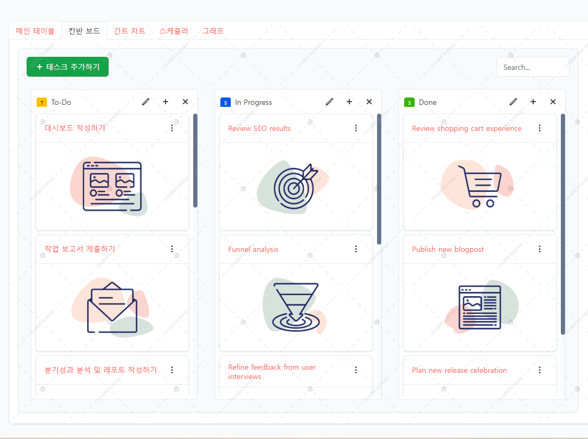

# Kendo UI CRM Dashboard POC

Kendo UI React 컴포넌트를 활용한 CRM(고객 관계 관리) 대시보드 POC(Proof of Concept) 프로젝트입니다.


<div style="display: flex; justify-content: space-between;">
  
  
  
</div>


## 🚀 주요 기능

### 📊 메인 테이블 (CrmGrid)
- 고객 데이터 CRUD 기능
- 실시간 인라인 편집
- 사용자 정의 컬럼 추가/삭제 
- 드래그 앤 드롭 컬럼 재정렬
- 프로필 이미지 및 상세 정보 팝업
- 파일 첨부 기능
- 다중 선택 및 일괄 삭제

### 📋 칸반 보드 (KanbanBoard) 
- 드래그 앤 드롭으로 작업 상태 변경
- 작업 추가/수정/삭제
- 작업 우선순위 설정
- 진행 상태별 시각화

### 📅 간트 차트 (GanttChart)
- 프로젝트 일정 관리
- 작업 의존성 설정
- 진행률 표시
- 타임라인 확대/축소

### 📆 스케줄러 (Scheduler)
- 일/주/월/타임라인 보기
- 다국어 지원 (한국어/영어)
- 다중 시간대 지원
- 반복 일정 설정

### 📈 분석 대시보드 (Analytics)
- 작업 현황 파이 차트
- 프로젝트 진행 상태 컬럼 차트
- 실시간 데이터 반영

## 🗂 프로젝트 구조
```
src/
├── components/                # 컴포넌트 디렉토리
│   ├── common/               # 공통 컴포넌트
│   │   ├── Avatar.tsx       # 프로필 아바타
│   │   └── Header.tsx       # 헤더 컴포넌트
│   │
│   ├── grid/                # 그리드 관련 컴포넌트
│   │   ├── CrmGrid.tsx      # 메인 CRM 그리드
│   │   └── GridPopup.tsx    # 그리드 팝업
│   │
│   ├── kanban/              # 칸반 보드 관련
│   │   ├── KanbanBoard.tsx  # 칸반 보드 메인
│   │   ├── Column.tsx      # 칸반 컬럼
│   │   └── Card.tsx        # 칸반 카드
│   │
│   ├── scheduler/           # 일정 관리 관련
│   │   ├── Scheduler.tsx   # 스케줄러 메인
│   │   └── EventForm.tsx   # 일정 입력 폼
│   │
│   └── analytics/          # 데이터 분석 관련
│       ├── Dashboard.tsx   # 대시보드 메인
│       └── Charts.tsx      # 차트 컴포넌트
│
├── store/                   # 상태 관리
│   ├── crmStore.ts         # CRM 관련 스토어
│   ├── kanbanStore.ts      # 칸반 관련 스토어
│   └── schedulerStore.ts   # 스케줄러 관련 스토어
│
├── types/                   # 타입 정의
│   ├── crm.ts              # CRM 관련 타입
│   ├── kanban.ts           # 칸반 관련 타입
│   └── scheduler.ts        # 스케줄러 관련 타입
│
├── styles/                  # 스타일 파일
│   ├── global.css          # 전역 스타일
│   └── components/         # 컴포넌트별 스타일
│
├── utils/                   # 유틸리티 함수
│   ├── dateUtils.ts        # 날짜 관련 유틸
│   └── formatters.ts       # 포맷 관련 유틸
│
└── assets/                 # 정적 자원
    ├── images/            # 이미지 파일
    └── icons/             # 아이콘 파일
```
## 🛠 기술 스택

- **React** + **TypeScript**
- **Kendo UI for React** - 강력한 UI 컴포넌트
- **Zustand** - 상태 관리
- **TailwindCSS** - 스타일링
- **Vite** - 빌드 도구

## 🚀 시작하기

```bash
# 의존성 설치
npm install

# 개발 서버 실행
npm run dev

# 프로덕션 빌드
npm run build
```
